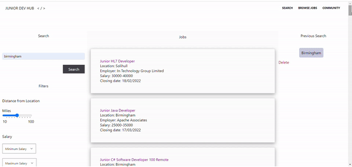

# <p align = "center" > Junior Developer Job Search Engine </p>


 <p align="center">
  
</p>


Link to deployed application: https://languagebytes.github.io/Junior-Dev-Job-Search-Engine/

## <p align="center"> Concept </p>

As Junior Developers browsing for jobs, we found that we had many tabs open with multiple job search engines. We wanted to create an application  specifically tailored to Junior Developers. The concept is to simplify the process, so that Junior Developers can quickly find the information they need. We also noticed that there was a lack of a community for Junior Developers where they can interact, share issues and ask questions, and a place offering career advice. We had also wanted to create a feature where potential employers could scout Juniors (CV Library). This is something we would like to try to build.


##  <p align="center"> Technology used </p>

- JavaScript 
- HTML 
- CSS 
- Tailwind Starter Kit
- FontAwesome
- Reed APIs - Search Jobs, Job Details
- Google Maps API
- Adzuna API


##  <p align="center"> Our Original User Story </p>

```
AS A junior developer
I WANT to be able to search for relevant job opportunities 
SO THAT I can find jobs that are relevant to me

GIVEN I am searching for a job
WHEN I am presented with the search field
THEN I can refine my search by location, distance from location, job type, salary, languages and keywords

WHEN I search by location
THEN I can either enter my location manually and track it using Google maps

WHEN I click the submit button
THEN I am presented with a list of search results matching my search criteria

WHEN I have made a search 
THEN it will be saved for me to refer back to in the future

WHEN I click on a job in the list
THEN I am presented with a description of the job with a link to apply
```

##  <p align="center"> Key Features </p>

- Filtered Search (Location, Maximum Salary, Job type, Distance from location, Keywords) 
- A more detailed description page of clicked job with link to apply
- A List of the top 3 tech hirers and where their locations are on Google maps
- Google maps Search Map on description page so that they can find the exact location
- Previous searches stored in Local Storage
- Community Page with information


 <p align="center">
  
</p>


##  <p align="center"> Comments on Code and Challenges </p>

The code contains functions which are quite repetitive. In the future we can refactor the code to make it more DRY and delegation of concern. 
We are currently relying on a server to access the Reed API as a temporary solution. In the future, we would like to be able to find a way around this issue which is more secure and reliable.

##  <p align="center"> Future Developments </p>

- Refactoring the code
